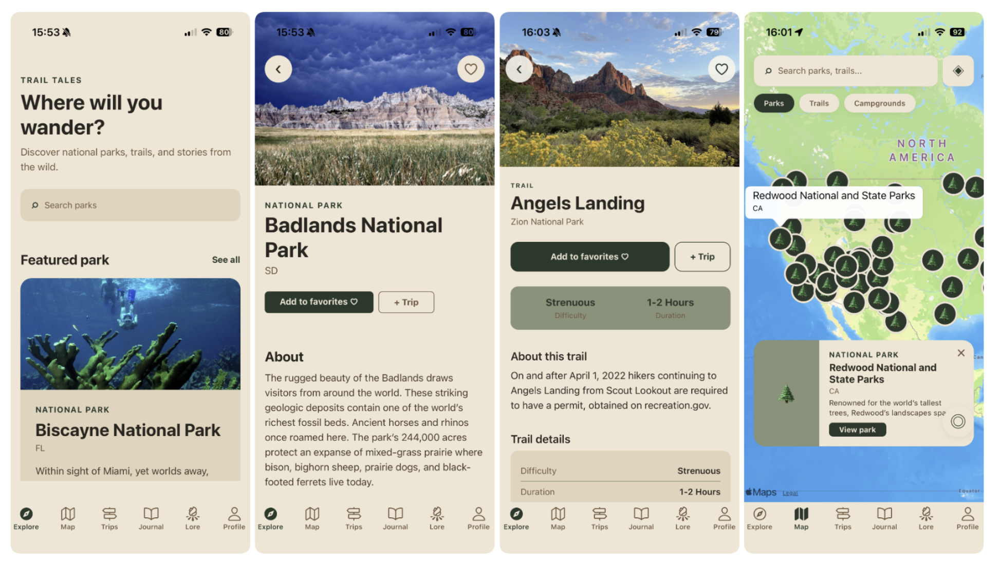
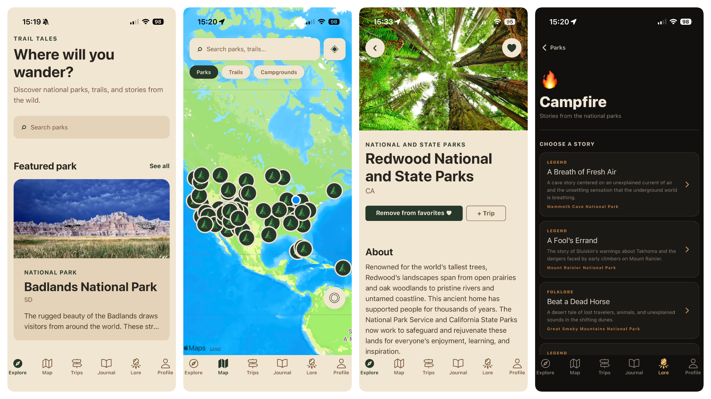
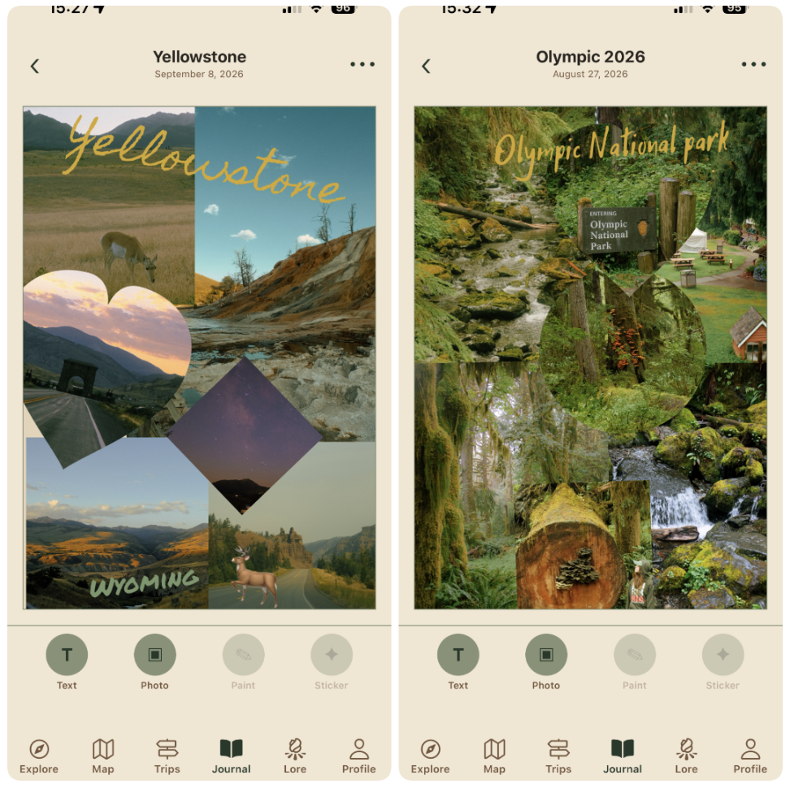
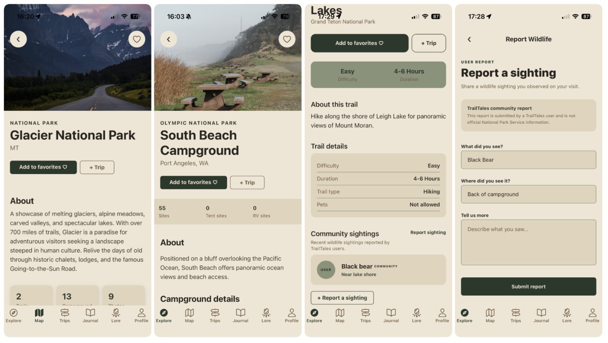
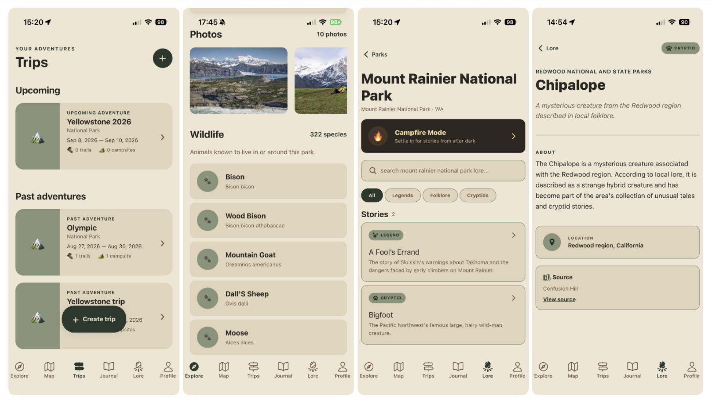
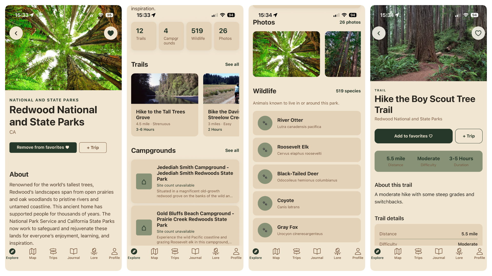
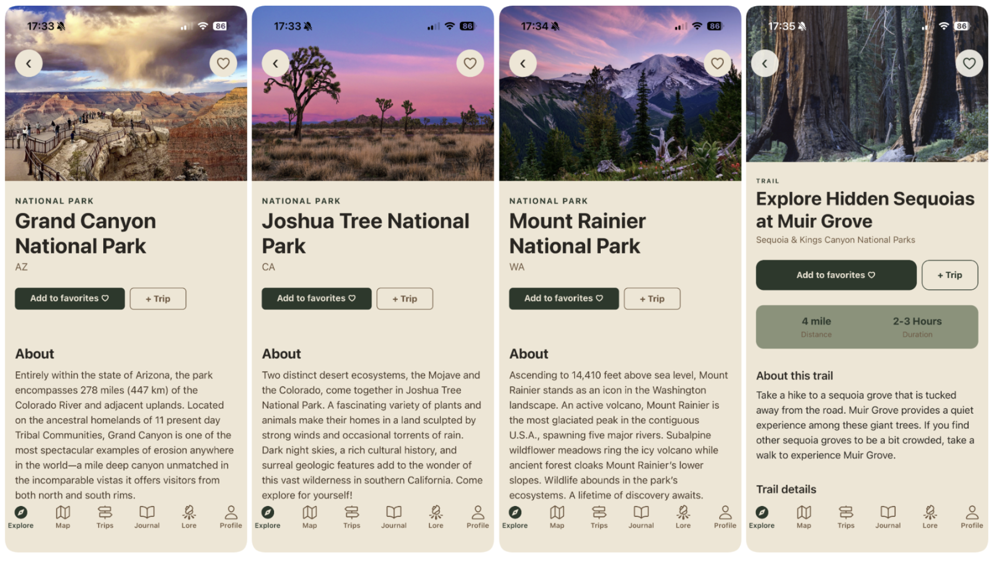

# TrailTales

TrailTales is a cross-platform mobile application designed to help users discover US National Parks, plan outdoor trips, learn about wildlife, record their experiences and explore folklore and mysterious stories associated with national parks.

The application combines practical trip-planning functionality with exploration and storytelling features to create a more complete national park companion.

## Features

### Explore

The Explore section allows users to discover and browse US National Parks using information provided by the National Park Service API.

Users can:

- browse national parks
- search for parks
- view detailed park information
- explore trails associated with a park
- view available activities
- view campgrounds
- view visitor information
- access additional park information and details

### Map

The Map section provides a geographical way to explore national park locations and related information.

It complements the list-based Explore experience by allowing users to discover parks spatially.

### Trips

The Trips section provides tools for planning and organising national park adventures.

Users can:

- create trips
- select a national park for a trip
- add trails to a trip
- add campsites to a trip
- add activities to a trip
- assign dates to trip items
- assign start times to trails and activities
- view saved trip details
- access saved trails and campsites from the trip details
- view campsite numbers when available
- remove trip items
- update existing trips
- delete trips

Trip information is persisted using Supabase.

### Journal

The Journal section allows users to record their experiences and maintain personal journal entries associated with their adventures.

Journal content is stored persistently using Supabase.

### Wildlife

TrailTales provides official wildlife information for national parks using NPSpecies/IRMA data.

The wildlife feature:

- displays animal species associated with a park
- filters species to those currently marked as present
- displays common names
- displays scientific names
- removes duplicate species
- initially displays five species at a time
- allows users to reveal additional species using the "See more" option

### Community Wildlife Reports

Users can submit wildlife reports associated with trails and campgrounds.

A report can contain:

- species
- location
- description
- associated park
- associated trail or campground
- report date

Wildlife reports are stored in Supabase and can be retrieved according to their associated location.

### Lore

Lore is one of the main features that differentiates TrailTales from a conventional national park planning application.

The Lore section contains stories and information relating to:

- folklore
- mysteries
- paranormal activity
- unusual events
- cryptids
- stories associated with national parks

The feature is intended to provide an additional exploratory and storytelling experience alongside the practical trip-planning features.

### Authentication

TrailTales supports user authentication through Supabase.

Users can:

- create an account
- sign in
- continue as a guest

Account creation includes validation for required fields, password length and matching password confirmation.

## Tech Stack

TrailTales was developed using the following technologies:

- React Native
- Expo
- JavaScript
- React Navigation
- React Native Safe Area Context
- React Native Maps
- React Native Community DateTimePicker
- Supabase
- National Park Service API
- NPSpecies/IRMA API
- Jest
- Jest Expo
- React Test Renderer
- AsyncStorage

## Application Architecture

The application uses a component-based React Native architecture.

Shared application state is managed through React Context, including trip-related state and wildlife report state.

The application separates external data access from screen components through dedicated API modules.

### Main API modules

`src/api/npsApi.js`

Handles National Park Service API requests, including:

- parks
- park details
- trails
- activities
- campgrounds
- visitor centres

`src/api/npsSpeciesApi.js`

Handles NPSpecies/IRMA requests and processes wildlife species information.

### Supabase

Supabase is used for persistent user-related information, including:

- trips
- journal entries
- favourites
- wildlife reports

## Project Structure

A simplified project structure is shown below:

    TrailTales/
    |
    ├── assets/
    |   └── application assets
    |
    ├── src/
    |   |
    |   ├── api/
    |   |   ├── npsApi.js
    |   |   └── npsSpeciesApi.js
    |   |
    |   ├── components/
    |   |   └── reusable application components
    |   |
    |   ├── constants/
    |   |   └── theme.js
    |   |   └── colors.js
    |   |   └── navigation.js
    |   |   └── spacing.js
    |   |   └── typography.js
    |   |
    |   ├── context/
    |   |   ├── TripContext.js
    |   |   └── WildlifeReportContext.js
    |   |
    |   |
    |   ├── navigation/
    |   |   └── app navigator and stacks
    |   |
    |   ├── screens/
    |   |   └── application screens
    |   |
    |   ├── services/
    |   |   ├── supabase.js
    |   |   └── lore.js      
    |   |   └── favorites.js  
    |   |   └── wildlifeReports.js    
    |   |
    |   └── _tests_/
    |       └── automated tests
    |
    ├── App.js
    ├── app.json
    ├── package.json
    └── README.md

## Requirements

To run TrailTales locally, the following are required:

- Node.js
- npm
- Expo
- an Expo-compatible mobile device or emulator
- a Supabase project
- a National Park Service API key

The project can be run using Expo Go for development and testing.

## Installation

Clone or extract the project and navigate to the project directory:

    cd TrailTales

Install the project dependencies:

    npm install

Start the Expo development server:

    npx expo start

The application can then be opened using:

- Expo Go on a physical device
- an Android emulator
- an iOS simulator
- a development build

## Environment Variables

TrailTales uses environment variables for external API configuration.

Create a `.env` file in the project root containing:

    EXPO_PUBLIC_SUPABASE_URL=your_supabase_url
    EXPO_PUBLIC_SUPABASE_ANON_KEY=your_supabase_publishable_or_anon_key
    EXPO_PUBLIC_NPS_API_KEY=your_nps_api_key

The `.env` file should not be committed to source control.

The Supabase key used by the application must be the client-side publishable/anon key and not the Supabase service-role or secret key.

## Supabase Configuration

A Supabase project is required for features involving persistent user data.

The application uses Supabase for authentication and database functionality.

The database includes functionality for storing information such as:

- user trips
- trip trails
- campsites
- activities
- journal entries
- favourites
- wildlife reports

Row Level Security should be enabled and configured appropriately for user-specific data.

## National Park Service API

TrailTales uses the National Park Service API to retrieve official national park and recreation information.

An NPS API key is required.

The application uses the API for information including parks, trails, activities, campgrounds and visitor information.

Wildlife information is retrieved separately through the NPSpecies/IRMA system, with no API key needed

## Navigation

The application uses React Navigation to provide the main navigation structure.

The primary sections are:

- Explore
- Map
- Trips
- Journal
- Lore

Additional screens are accessed from these sections for detailed park information, trip management, trail selection, campground selection, activities, wildlife information and other application functionality.

## Testing

TrailTales includes an automated Jest test suite covering multiple layers of the application.

Tests cover:

- authentication
- adding activities
- adding trails
- trip state management
- wildlife reports
- wildlife report state management
- date utilities
- NPS API functionality
- NPSpecies API functionality

The tests include both unit-level tests and integration-style component tests.

### Add Trail Tests

The Add Trail screen is tested for:

- displaying trails belonging to the selected park
- filtering trails using the search field
- enabling the add button after selecting a trail
- adding a selected trail with its default date and time
- preventing an already-added trail from being added again
- using 8:00 AM as the default trail start time

External API calls are mocked during screen tests so that the tests remain deterministic and do not depend on network connectivity or an API key being available in the test environment.

### API Tests

The NPS API and NPSpecies API have separate test suites that test their data processing and error-handling behaviour.

### Running Tests

Run the complete test suite using:

    npm test -- --runInBand

To run a specific test file:

    npm test -- addTrailScreen.test.js

## Error Handling

The application includes error handling for external data requests and database operations.

For example, if park or trail information cannot be loaded, the relevant screen displays an error state rather than leaving the user with an empty or unresponsive interface.

Database errors are also handled by the application context and service layers.

Authentication errors are presented to users through appropriate error messages.

## Design

TrailTales uses a consistent visual theme inspired by national parks and outdoor exploration.

The application uses a central theme configuration for:

- colours
- typography
- spacing
- border radii
- other reusable design values

This allows screens and components to maintain a consistent visual identity.

The interface was designed to prioritise clear information hierarchy, readable content and straightforward navigation while maintaining a visual identity appropriate for an outdoor exploration application.

## Screenshots

## Known Limitations and Future Development

The current version of TrailTales was developed within the time and scope constraints of the university project. There are several areas that could be expanded in future versions.

Potential future improvements include:

- richer offline support for areas with limited connectivity
- additional community features such as user-submitted campfire stories and photos
- more advanced trip recommendations
- expanded wildlife reporting
- publicly shareable trips and itineraries
- comments or chat for people currently in a park
- park, trail and campground ratings
- exploring parks by terrain
- additional journal options such as drawing and stickers
- journal exporting
- support for different measurement units
- nearby trail and campground recommendations
- trip tags
- trips containing multiple parks
- live trail progress and completion percentages
- profile badges
- profile statistics such as parks visited, trails completed and miles travelled
- publicly shareable journals
- support for parks in more countries

These features were outside the practical scope of the current project but provide potential directions for future development.

## Project Purpose

TrailTales was created as a university mobile development project to demonstrate the design, development and evaluation of a functional cross-platform mobile application.

The project demonstrates the use of:

- mobile application development
- React Native and Expo
- API integration
- asynchronous data handling
- persistent cloud storage
- authentication
- shared application state
- navigation
- user-generated content
- automated testing
- responsive mobile UI design

The final application combines these technologies with a distinctive national park exploration and storytelling concept.